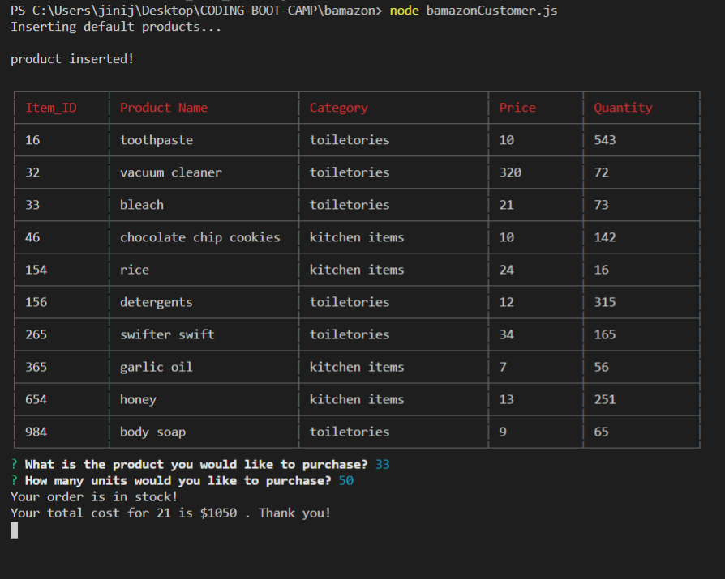
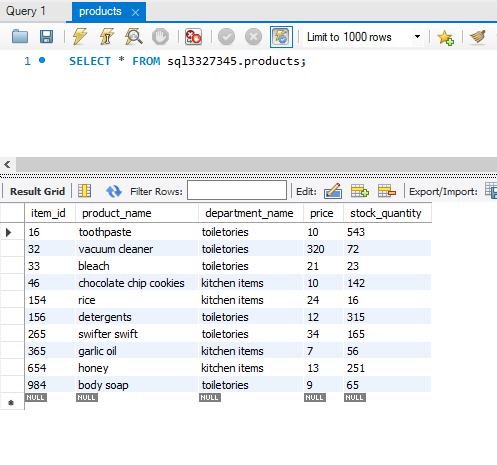

# Bamazon

### What Is *Bamazon*

 LIRI is a _Language_ Interpretation and Recognition Interface. LIRI will be a command line node app that takes in parameters and gives you back data.

 ### NPM Packages
 
 * `mysql`
 * `inquirer`
 * `cli-table`

## Node commands

  * `bamazonCustomer.js`
  * `bamazonManager.js`
  * `bamazonSupervisor.js`

  ## Tools

  * `GitHub`
  * `Text Editor`
  * `Node.js`
  * `MySQL Workbench`

  ## Database
  
  * `MySQL` (https://developer.spotify.com/)
  * `FreeSQLdatabase` (https://www.freesqldatabase.com/)

 
## What Each Command Should Do

1. `node bamazonCustomer.js`

   * The app will prompt users with two messages.

      * The first will ask them the ID of the product they would like to buy.
      * The second message will ask how many units of the product they would like to buy.

   * Once the customer has placed the order, the application will check if the store has enough of the product to meet the customer's request.

      * If not, the app will log a phrase like `Insufficient quantity!`, and then prevent the order from going through.

   * However, if the store _does_ have enough of the product, it will fulfill the customer's order.

      * This means updating the SQL database to reflect the remaining quantity.
      * Once the update goes through, show the customer the total cost of their purchase.

2. `node bamazonManager.js`

   * List a set of menu options:

    * View Products for Sale
    
    * View Low Inventory
    
    * Add to Inventory
    
    * Add New Product

  * If a manager (user) selects `View Products for Sale`, the app should list every available item: the item IDs, names, prices, and quantities.

  * If a manager selects `View Low Inventory`, then it should list all items with an inventory count lower than five.

  * If a manager selects `Add to Inventory`, your app should display a prompt that will let the manager "add more" of any item currently in the store.

  * If a manager selects `Add New Product`, it should allow the manager to add a completely new product to the store.

3. `node bamazonSupervisor.js`

  * When a supervisor selects `View Product Sales by Department`, the app should display a summarized table in their terminal/bash window. Use the table below as a guide.

| department_id | department_name | over_head_costs | product_sales | total_profit |
| ------------- | --------------- | --------------- | ------------- | ------------ |
| 01            | Electronics     | 10000           | 20000         | 10000        |
| 02            | Clothing        | 60000           | 100000        | 40000        |

  

   * The `total_profit` column should be calculated on the fly using the difference between `over_head_costs` and `product_sales`. 

  `Below are screenshots of the terminal and MySQL Workbench`

    

    

    

    

    
